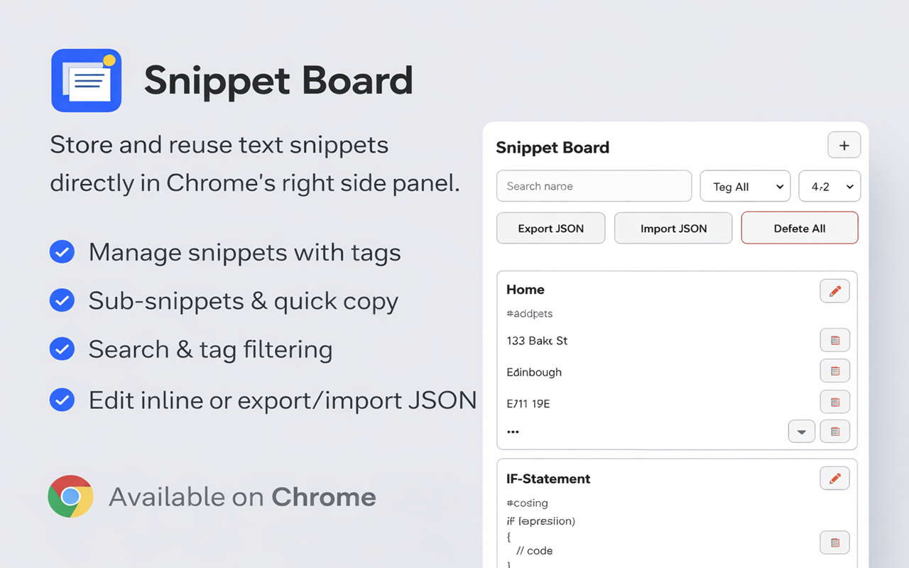

# Snippet Board (Chrome Extension)

## About

Snippet Board is a Chrome side-panel extension for storing and reusing text snippets while you browse.
It lets you organize snippets with tags, manage multiple sub-values per snippet, quickly copy individual values, and back up your data with JSON import/export.
All snippet data is stored locally in your Chrome profile.

## Chrome Web Store

Snippet Board is published on the Chrome Web Store:

- https://chromewebstore.google.com/detail/jnbmkcfajdcmbkbacmndlcknbdamgomm?utm_source=item-share-cb

## Screenshot

## Load in Chrome

1. Open `chrome://extensions`
2. Enable **Developer mode**
3. Click **Load unpacked**
4. Select this folder: `C:\work\_scripts\chrome\snippet_board`
5. Click **Reload** for this extension after changes
6. Click the extension icon to open the right sidebar panel

## Features

- Right sidebar (not popup), opened via extension icon
- Custom extension icon set (16/32/48/128)
- `+` icon to show/hide the add-snippet form
- Multiple values (sub-snippets) per snippet
- Optional single tag per snippet (create/edit)
- Tag suggestions while typing (based on existing snippet tags)
- Name sorting (`A-Z` and `Z-A`)
- Quick search filter by snippet title
- Tag filter dropdown (AND-combined with text search)
- Per-value copy with icon button
- Per-value hide/show support (`***` masking + eye toggle)
- Permanent per-snippet edit button in header (no hover pop-up actions)
- Edit snippets including title, tag, and sub-snippet add/remove/hide
- Delete whole snippet inside edit mode with inline confirmation
- Inline delete confirmation for sub-snippets
- Delete sub-snippets with a bin icon (`🗑️`)
- Delete all snippets with inline confirmation
- Export snippets to JSON
- Import snippets from JSON (merged with existing snippets, legacy format supported)
- Auto-dismissing status messages for import/export/delete actions
- Persist snippets in Chrome local storage

## If panel does not open on the right

- In `chrome://extensions`, click **Reload** for this extension
- Remove and add the extension again if Chrome still uses old behavior

## Disclaimer

- This extension is not a password manager.
- Snippet data is stored in Chrome extension local storage without encryption.
- Do not store passwords, API secrets, private keys, or other sensitive credentials in this extension.
